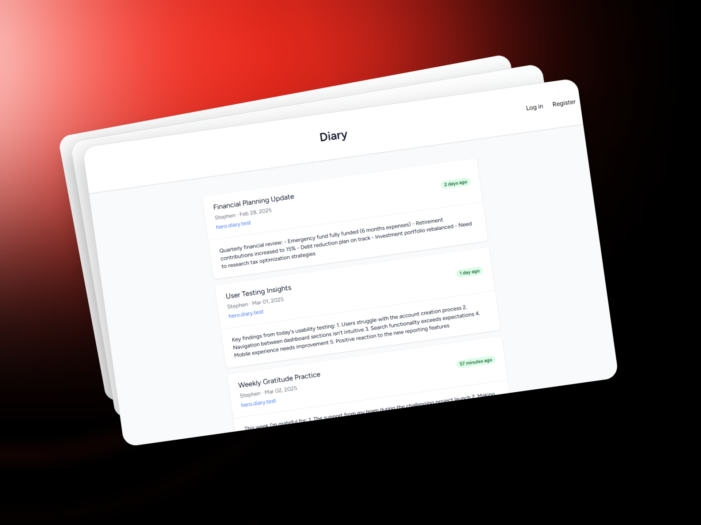

# **Diary**

---

**Diary** is a robust personal journaling platform built with Laravel that allows users to create, manage, and publish their notes within individual subdomains. This application demonstrates subdomain-based multi-tenancy architecture with Laravel, providing each user with their own personalized space at their subdomain. Users can create, publish, and delete notes, with published notes appearing on both the main welcome page and the user's subdomain welcome page. Guest users can also view published notes without authentication.

The platform includes authentication features powered by **Laravel Breeze**, allowing users to register themselves with a unique subdomain. This project was built to test and demonstrate knowledge of multi-tenancy, subdomain routing, and CRUD operations in Laravel.



## **Features**

1. **Multi-Tenancy with Subdomains**:
    - Each user gets a unique subdomain (e.g., `username.diary.test`).
    - Subdomain-based routing ensures users access their personalized journaling space.

2. **Note Management**:
    - Users can create, edit, and delete notes.
    - Notes can be published or kept private.
    - Published notes are visible to both the user and guest visitors.

3. **Public and Private Notes**:
    - Published notes appear on the main welcome page and the user's subdomain welcome page.
    - Private notes are only visible to the authenticated user.

4. **Authentication**:
    - Built with **Laravel Breeze** for seamless user registration and login.
    - Users can register with a unique subdomain during signup.

5. **Responsive Design**:
    - The platform is designed to be fully responsive, ensuring a great experience on all devices.


## **Technologies Used**

- **Laravel** (PHP Framework)
- **Laravel Breeze** (Authentication)
- **MySQL** (Database)
- **Tailwind CSS** (Styling)
- **Blade & Livewire** (Frontend)
- **Subdomain Routing** (Multi-Tenancy)


## **Installation**

Follow these steps to set up the project locally:

1. **Clone the Repository**:
   ```bash
   git clone https://github.com/SKSritharan/diary.git
   cd diary
   ```

2. **Install Dependencies**:
   ```bash
   composer install
   npm install
   ```

3. **Set Up Environment File**:
    - Copy `.env.example` to `.env` and update the database credentials:
      ```bash
      cp .env.example .env
      ```
    - Generate an application key:
      ```bash
      php artisan key:generate
      ```

4. **Configure Subdomains**:
    - Update your local development environment (e.g., Laravel Valet or Homestead) to support wildcard subdomains.


5. **Run Migrations**:
   ```bash
   php artisan migrate
   ```

6. **Compile Assets**:
   ```bash
   npm run dev
   ```

7. **Start the Development Server**:
   ```bash
   php artisan serve
   ```

8. **Access the Application**:
    - Visit `http://diary.test` to access the main welcome page.
    - Register a new user with a unique subdomain (e.g., `john.diary.test`).

## **Acknowledgments**

- **Laravel** for providing an excellent PHP framework.
- **Laravel Breeze** for simplifying authentication.
- **Tailwind CSS** for making styling effortless.
- **Livewire** for interactive components.


Thank you for checking out **Diary**! 🚀
---

